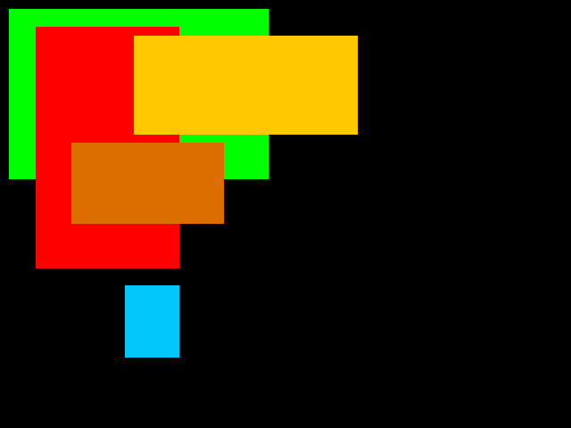
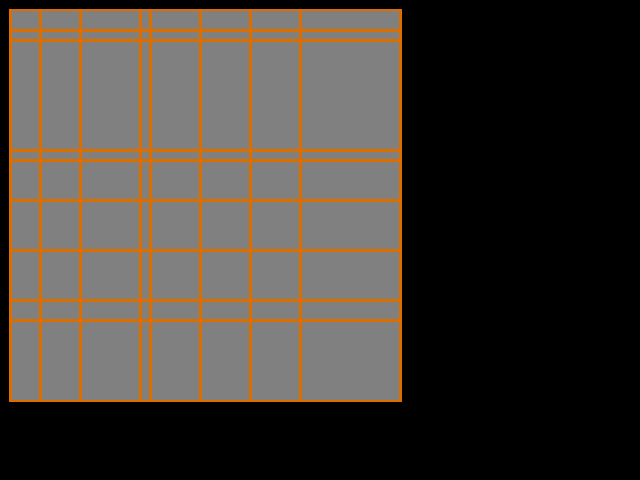
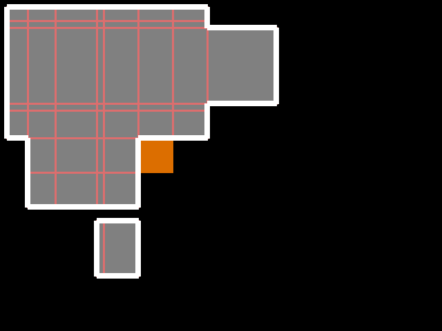
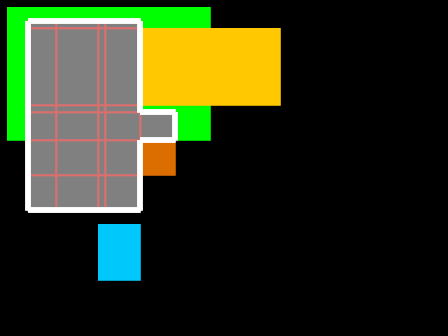
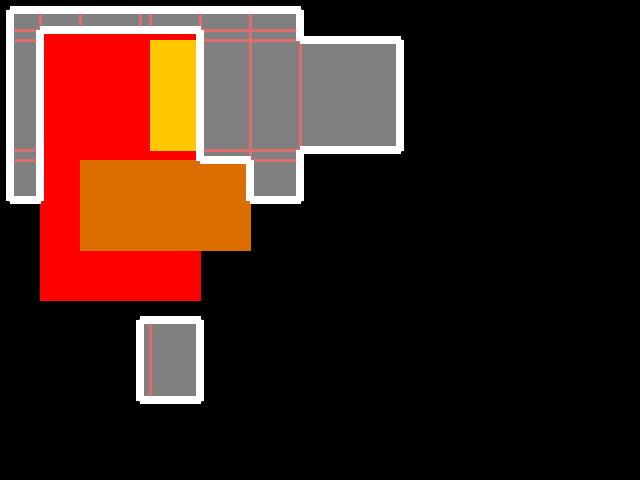

# PHP-RECTSLIB
This class Lib help you to construct the rectangles using various logical operations such as Union, Intersect abd Subtract.

## Algorythm
Algorythm is very simple.
- A region on which contains all the rectangles is divided into several rectangles according to the corners of the rectangles.
- Remove the rectangles above which does not lie inside all rectangles. This step gives the non-overlapped union of the rectangles.
- Then choose or remove the rectangles which lies inside the subject rectangles according to boolean operation union, intersect or subtract.

## Check with Images
### Original Rectangkes

- A-GREEN-{10,10:300,200}
- B-RED-{40,30:200,300}
- C-ORANGE-{150,40:400,150}
- D-BLUE-{140,320:200,400}
- E-BROWN-{80,160:250,250}

### Start meshing for all rectangles

### Meshing and get union of rectangles
Union of [A B] & [C D]

### Intersection of all with 2 rectangles
Intersect of [A B C D] & [B E]

### Subtract of 2 from all
Subtract [B E] from [A B C D]

## Contact
Contact me for comercial use via mail winaungcho@gmail.com.

